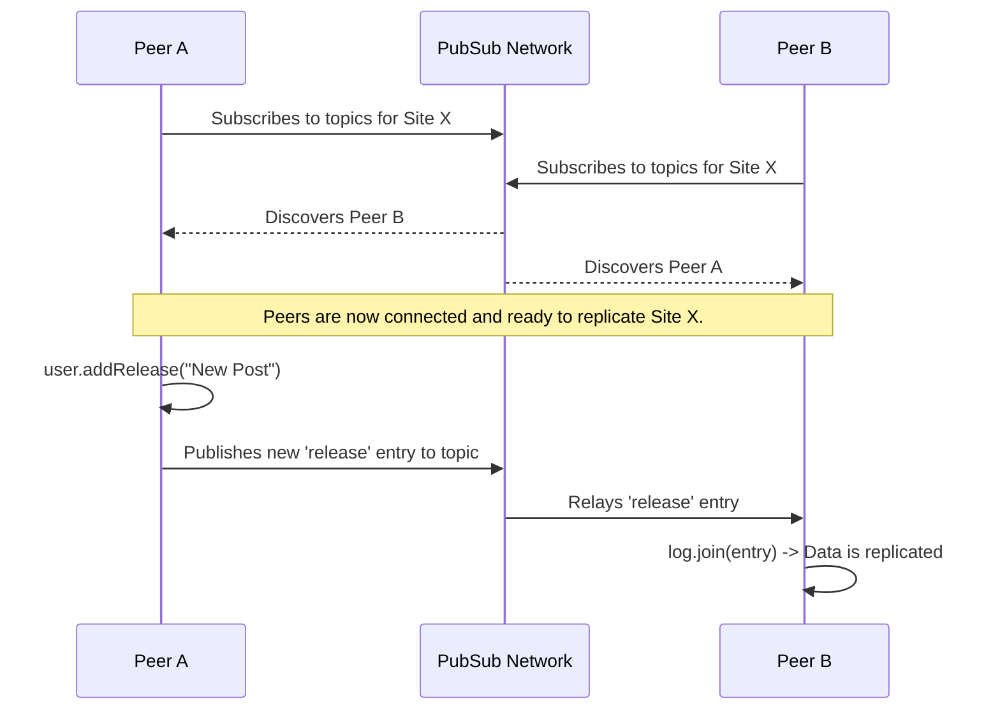

## Architecture and Data Flow of the Lens Defederation System

### 1. Overview

The Lens Defederation System is a decentralized content management and distribution network built on the Peerbit P2P framework. Its core purpose is to allow independent "Sites" to operate as self-contained databases while also being able to "federate" or "subscribe" to content from other sites.

This architecture enables a powerful model where each site owner maintains full control over their own content and user permissions but can pull in and re-distribute content from other sites they trust. The system is designed to be robust, secure, and scalable, leveraging Peerbit's automatic replication, access control, and a hybrid data synchronization model.

### 2. Core Architectural Components

The entire system is orchestrated by the `LensService` class, but the fundamental building blocks are defined in `schema.ts`.

#### 2.1. The `Site` Program

The central component of the system is the `Site` class. It is a composite **`Program`** in Peerbit, acting as a container for all the data and logic related to a single content hub.

*   **Identity**: Each `Site` has a unique, cryptographically generated address. This address serves as its global identifier within the network.
*   **Encapsulation**: It encapsulates all related data stores (releases, subscriptions, access control lists) into a single, replicable unit.

```typescript
// schema.ts
@variant('site')
export class Site extends Program<SiteArgs> {
  @field({ type: Documents })
  releases: Documents<Release, IndexableRelease>;

  @field({ type: Documents })
  featuredReleases: Documents<FeaturedRelease, IndexableFeaturedRelease>;

  // ... other stores

  @field({ type: IdentityAccessController })
  members: IdentityAccessController;

  @field({ type: IdentityAccessController })
  administrators: IdentityAccessController;

  // ... site metadata
}
```

#### 2.2. Internal Data Stores

Each `Site` program contains several internal **`Documents`** stores. Each store is a separate, fully-fledged database with its own topic for replication. This separation is key to the system's modularity.

*   **`releases`**: The primary content store for things like articles, videos, or music releases.
*   **`featuredReleases`**: A store to highlight specific releases, often used for a site's homepage.
*   **`contentCategories`**: For organizing releases into categories.
*   **`subscriptions`**: **The engine of federation.** This store holds a list of other `Site` addresses that the current site is subscribed to.
*   **`blockedContent`**: An admin-only store to list CIDs of content that should be hidden or censored.

#### 2.3. Access Control Layer

Security and permissions are managed by two dedicated `IdentityAccessController` programs within each `Site`.

*   **`members`**: Holds a list of public keys that are granted "member" privileges. Typically, members can create content (e.g., `addRelease`).
*   **`administrators`**: Holds a list of public keys with full administrative control. Admins can manage all content, subscriptions, and permissions for both members and other admins.

Access checks are performed within the `canPerform` hooks of each data store. This hook now uses a helper, `canPerformFederatedWrite`, which elegantly handles the distinction between local and federated content.

```typescript
// schema.ts -> Site.open()
this.releases.open({
  // ...
  canPerform: (props) => canPerformFederatedWrite(
    this.address,
    props,
    this.subscriptions,
    this.releases,
    Release,
    // This is the fallback check for local content
    (localProps) => props.type === 'put' ? memberCanPerform(localProps) : administratorCanPerform(localProps),
  ),
  // ...
});
```

The `canPerformFederatedWrite` helper checks if the content's origin address is the local site's address. If it is, it defers to the standard member/admin check. If not, it checks if the local site is subscribed to the origin site. This is a critical security gate.

#### 2.4. The `LensService`

This class (`service.ts`) acts as the high-level API and orchestrator for the entire system. It abstracts away the complexities of Peerbit and provides a clean, promise-based interface for applications.

*   **Lifecycle Management**: Handles initializing and stopping the underlying `Peerbit` client.
*   **Site Management**: Manages opening, closing, and interacting with the primary `Site` program.
*   **Defederation Logic**: Contains the crucial `startFederation` and `stopFederation` methods that manage the data flow between sites.
*   **API Facade**: Exposes methods like `getReleases`, `addSubscription`, etc., which translate simple calls into operations on the appropriate internal stores.

### 3. Data Flow and Key Processes

#### 3.1. Single Site Replication

This is the standard Peerbit replication model and the foundation of the system.

1.  **Peer A** initializes the `LensService` and calls `openSite(new Site(...))`. This creates a new `Site` program with a unique address.
2.  **Peer B** initializes its own `LensService` and calls `openSite('address-of-site-A')`.
3.  **Topic Subscription**: Both peers' services automatically subscribe to the topics associated with *each internal store* (releases, featuredReleases, etc.) of that specific `Site`.
4.  **Discovery & Replication**: Through the shared topics, Peer A and Peer B discover each other.
5.  When Peer A adds a release, the new entry is published on the `releases` store's topic. Peer B receives it and automatically uses the internal `log.join()` method to merge the entry into its local `releases` store. Replication is bidirectional and automatic for all shared stores.



#### 3.2. The Defederation Data Flow (Hybrid Model)

Defederation is now a sophisticated **hybrid model** combining an initial historical sync with real-time push updates. This is managed by the `subscriptions` store.

1.  **Trigger**: An **Admin** of `Site A` decides they want to show content from `Site B`. They call `addSubscription({ siteAddress: 'address-of-site-B' })`.
2.  **Event Listener**: The `LensService` on `Site A` is listening for changes to its *own* `subscriptions` store (`_handleSubscriptionChange`).
3.  **Start Defederation**: When the new subscription entry is detected, `service.startFederation('address-of-site-B')` is called on `Site A`'s node. This initiates two concurrent processes:

    *   **Phase 1: Historical Sync (Fire-and-forget Pull)**
        *   The `runHistoricalSync` method is invoked. It opens `Site B`'s program with selective replication (`replicate: false` for sensitive stores).
        *   It then enters a **temporary polling loop**, fetching the latest entry heads from `Site B`'s content stores (`releases`, etc.) and joining them into `Site A`'s local stores.
        *   This process has a fixed duration (e.g., 1 minute) and is designed to efficiently backfill recent content. It runs in the background and cleans up its own resources (closing the remote program handle, clearing the timeout).

    *   **Phase 2: Live Updates (Push via Pub/Sub)**
        *   Simultaneously, `startFederation` subscribes `Site A`'s client to a dedicated topic for `Site B`: **`${address-of-site-B}/federation`**.
        *   On `Site B`'s end, the `setupFederationBroadcasts` method listens for any local changes to its content stores. When a change occurs (e.g., a new release is added), it creates a `FederationUpdate` message.
        *   This `FederationUpdate` message, containing the new entries, is published to `Site B`'s own federation topic.
        *   `Site A`'s `onFederationMessage` handler, listening on this topic, receives the update, deserializes it, and joins the new entries into its local database.

4.  **Permission Check on Join**: Whether an entry arrives via historical sync or a live update, `Site A`'s `releases` store triggers its `canPerform` hook. The `canPerformFederatedWrite` helper verifies that `Site A` is indeed subscribed to `Site B` before allowing the federated content to be saved.

```mermaid
graph TD
    subgraph Site A Node
        A_Service[LensService]
        A_SubsDB[subscriptions]
        A_ReleasesDB[releases]
    end

    subgraph Site B Node
        B_ReleasesDB[releases]
    end
    
    subgraph Defederation Topic
      direction LR
      F_Topic[(`${Site B Address}/federation`)]
    end

    Admin -- 1. addSubscription('Site B') --> A_Service
    A_Service -- 2. Puts entry into --> A_SubsDB
    A_SubsDB -- 3. Emits 'change' event --> A_Service
    A_Service -- 4. Calls startFederation('Site B') --> A_Service

    A_Service -- "Phase 1: runHistoricalSync" --> B_ReleasesDB
    A_Service -- "Phase 2: Subscribes to" --> F_Topic
    
    B_ReleasesDB -- "Local change occurs" --> SiteB_Handler(broadcastFederationUpdate)
    SiteB_Handler -- "Publishes 'FederationUpdate'" --> F_Topic
    F_Topic -- "Pushes message to subscriber" --> A_Service
    A_Service -- "Joins live update" --> A_ReleasesDB

    style A_Service fill:#f9f,stroke:#333,stroke-width:2px
    style B_ReleasesDB fill:#bbf,stroke:#333,stroke-width:2px
    style F_Topic fill:#9f9,stroke:#333,stroke-width:2px
```

#### 3.3. Defederation Termination

1.  **Trigger**: An admin on `Site A` calls `deleteSubscription({ siteAddress: 'address-of-site-B' })`.
2.  **Event Listener**: The `_handleSubscriptionChange` listener on `Site A` detects the removal.
3.  **Stop Defederation**: It calls `stopFederation('address-of-site-B')`.
4.  **Cleanup**:
    *   The live update subscription is terminated by unsubscribing from the federation topic and removing the message listener.
    *   The abort signal for the historical sync is triggered, stopping its polling loop.
    *   A cleanup task is initiated to query all documents in `Site A`'s stores that originated from `Site B` (matching `siteAddress`) and deletes them. This ensures that when a federation is removed, the imported content is also purged.

***

### 4. Advantages of the Hybrid Defederation Model

The system's hybrid model combines the best of pull and push-based systems, enhancing scalability, security, and real-time responsiveness.

*   **Effortless Scalability & Efficiency**: Source sites do not bear the performance cost of managing and pushing updates to every individual subscriber. A single site can be federated by thousands of others without performance degradation. The fire-and-forget nature of pub/sub broadcasts is highly efficient and decouples the source from its subscribers.

*   **Granular Security and Control**:
    *   **Subscriber Sovereignty**: Subscribers have complete control. Defederation is an explicit, opt-in action. A site only ingests content from sources it has actively subscribed to, preventing data spam.
    *   **Source Data Protection**: Source sites are inherently secure. They never expose sensitive data like user lists or administrative settings because subscribers are configured to only replicate public content stores during the initial historical sync.

*   **Real-Time & Resilient Architecture**:
    *   **Low Latency**: After the initial sync, new content is pushed in near real-time via the pub/sub topic, providing a much better user experience than a purely polling-based model.
    *   **High Autonomy**: Each site operates as a sovereign entity. The failure or shutdown of a source site does not impact its subscribers, who continue to function with the content they have already pulled.

*   **Enables Curation**: This model naturally encourages content curation. Site owners can subscribe to multiple sources to create unique, aggregated feeds for their communities, acting as curators without needing explicit permission from the source.